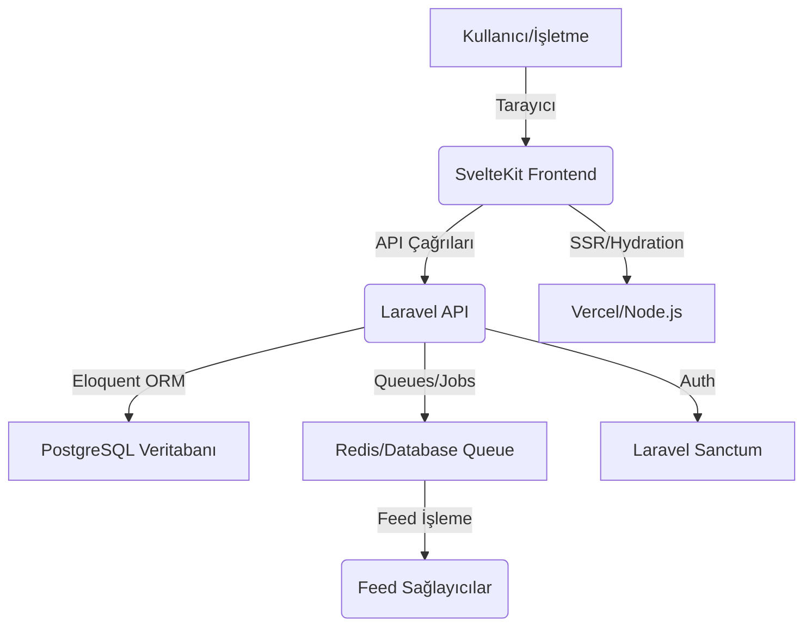

# Tutarnet: Zirve Performanslı Fiyat ve Hizmet Karşılaştırma Platformu


## 🚀 Proje Vizyonu

Tutarnet, web teknolojilerinin en uç noktası olan **SvelteKit** ve **Laravel** mimarisi üzerine inşa edilmiş, dünyanın en hızlı ve en akıcı fiyat karşılaştırma platformudur. Amacımız, kullanıcılara milisaniyeler içinde sonuç veren, Apple kalitesinde animasyonlarla donatılmış ve SEO skorlarında rakipsiz bir deneyim sunmaktır.

## ✨ Temel Özellikler

*   **Işık Hızında Performans:** SvelteKit'in sıfır Virtual DOM yapısı ile anında açılan sayfalar.
*   **Pürüzsüz Animasyonlar:** Svelte'in yerleşik geçiş efektleri ile mobil uygulama kalitesinde kullanıcı deneyimi.
*   **Güçlü Backend:** Laravel 11 ile ölçeklenebilir, güvenli ve yüksek performanslı API katmanı.
*   **Akıllı Fiyat Karşılaştırma:** Binlerce ürün ve hizmet için anlık veri senkronizasyonu.
*   **Kapsamlı Paneller:** Kullanıcı, Mağaza, Hizmet ve Admin için özelleştirilmiş, havalı yönetim arayüzleri.
*   **SEO Şampiyonu:** Sunucu tarafında render (SSR) ve optimize edilmiş HTML yapısı ile Google dostu mimari.

## 🛠️ Teknik Mimari (Zirve Mimari)

Tutarnet, modern web geliştirme dünyasının en "havalı" ve en işlevsel iki devini birleştirir.

### Ana Teknolojiler

| Kategori | Teknoloji | Açıklama |
| :--- | :--- | :--- |
| **Frontend** | SvelteKit 5, Svelte 5, TypeScript | Sıfır Virtual DOM, inanılmaz hız ve pürüzsüz animasyonlar. |
| **Backend (API)** | Laravel 11, PHP 8.3 | Güçlü iş mantığı, Eloquent ORM ve ölçeklenebilir API yönetimi. |
| **Stil** | Tailwind CSS 4 | Dünyanın en hızlı CSS framework'ünün en yeni sürümü. |
| **Veritabanı** | PostgreSQL | Güvenilir ve ölçeklenebilir ilişkisel veri depolama. |
| **Kimlik Doğrulama** | Laravel Sanctum | Token tabanlı güvenli API erişimi. |

### Mimari Diyagramı



## ⚙️ Kurulum

### 1. Backend (Laravel) Kurulumu
```bash
cd tutarnet-backend
composer install
cp .env.example .env
php artisan key:generate
php artisan migrate
php artisan serve
```

### 2. Frontend (SvelteKit) Kurulumu
```bash
cd tutarnet
pnpm install
pnpm dev
```

## 🔒 Güvenlik ve Performans
*   **SvelteKit SSR:** Veriler sunucuda çekilir, kullanıcıya hazır HTML gönderilir.
*   **Laravel Sanctum:** Güvenli, token tabanlı oturum yönetimi.
*   **Tailwind 4:** Modern tarayıcı özellikleri ile optimize edilmiş stil katmanı.
*   **Pürüzsüz Geçişler:** Sayfalar arası geçişlerde `fade` ve `fly` efektleri ile kesintisiz deneyim.

---

**Manus AI** tarafından web teknolojilerinin zirvesinde oluşturulmuştur.
