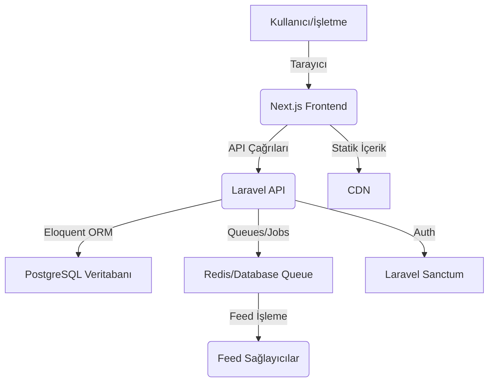

# Tutarnet: Akıllı Fiyat ve Hizmet Karşılaştırma Platformu


## 🚀 Proje Vizyonu

Tutarnet, kullanıcıların ürün ve hizmet fiyatlarını şeffaf bir şekilde karşılaştırmasına olanak tanıyan, mağazalar ve hizmet sağlayıcılar için güçlü yönetim panelleri sunan yenilikçi bir platformdur. Amacımız, tüketicilere en iyi fırsatları sunarken, işletmelerin de dijital dünyada daha geniş kitlelere ulaşmasını sağlamaktır. Modern teknolojilerle desteklenen Tutarnet, performans, güvenlik ve kullanıcı deneyimini ön planda tutarak dinamik bir pazar yeri oluşturmayı hedefler.

## ✨ Temel Özellikler

*   **Akıllı Fiyat Karşılaştırma:** Binlerce ürün ve hizmet için anlık fiyat takibi ve karşılaştırma.
*   **Kapsamlı Mağaza/Hizmet Panelleri:** İşletmelerin ürünlerini/hizmetlerini, siparişlerini ve müşteri ilişkilerini kolayca yönetebileceği sezgisel arayüzler.
*   **Gelişmiş Admin Paneli:** Platformun tüm yönlerini (kullanıcılar, mağazalar, hizmetler, içerikler, raporlar) yönetmek için merkezi bir kontrol noktası.
*   **Otomatik Feed Senkronizasyonu:** Laravel Queues ile arka planda çalışan, yüksek performanslı XML/CSV feed işleme sistemi.
*   **Kullanıcı Hesap Yönetimi:** Favori ürünler, fiyat alarmları ve kişiselleştirilmiş deneyimler.
*   **Güvenli Kimlik Doğrulama:** Laravel Sanctum ile token tabanlı güvenli API erişimi.
*   **SEO Dostu URL Yapısı:** Arama motorları için optimize edilmiş, anlamlı ve temiz URL'ler.
*   **Duyarlı Tasarım:** Tüm cihazlarda sorunsuz bir kullanıcı deneyimi sunan mobil uyumlu arayüz.

## 🛠️ Teknik Mimari

Tutarnet, modern web geliştirme standartlarına uygun, ayrıştırılmış (decoupled) bir mimari üzerine inşa edilmiştir.

### Ana Teknolojiler

| Kategori | Teknoloji | Açıklama |
| :--- | :--- | :--- |
| **Frontend** | Next.js 16, React 19, TypeScript | Hızlı geliştirme, sunucu tarafı render (SSR) ve modern UI deneyimi. |
| **Backend (API)** | Laravel 11, PHP 8.3 | Güçlü iş mantığı, Eloquent ORM ve ölçeklenebilir API yönetimi. |
| **Veritabanı** | PostgreSQL | İlişkisel veri yönetimi, güvenilir ve ölçeklenebilir veri depolama. |
| **Kimlik Doğrulama** | Laravel Sanctum | Token tabanlı güvenli kullanıcı ve yönetici oturum yönetimi. |
| **Stil** | Tailwind CSS 4, Shadcn/ui | Hızlı ve tutarlı UI geliştirme için modern CSS araçları. |

### Mimari Diyagramı



## ⚙️ Kurulum

Projeyi yerel geliştirme ortamınızda çalıştırmak için aşağıdaki adımları izleyin.

### 1. Backend (Laravel) Kurulumu

```bash
cd tutarnet-backend
composer install
cp .env.example .env
php artisan key:generate
php artisan migrate
php artisan serve
```

### 2. Frontend (Next.js) Kurulumu

```bash
cd tutarnet
pnpm install
cp .env.example .env.local
pnpm dev
```

## 🗺️ URL Yapısı

Tutarnet, hem kullanıcı deneyimini hem de arama motoru optimizasyonunu (SEO) desteklemek amacıyla anlamlı ve hiyerarşik bir URL yapısı kullanır.

| Kategori | URL Yapısı | Açıklama |
| :--- | :--- | :--- |
| **Ana Sayfa** | `/` | Platformun ana sayfası. |
| **Ürün Detay** | `/m/[magazaslug]/[urunslug]` | Belirli bir mağazadaki ürünün detay sayfası. |
| **Mağaza Sayfası** | `/m/[magazaslug]` | Mağaza genel sayfası ve ürün listesi. |
| **Hizmet Detay** | `/h/[partnerslug]` | Hizmet sağlayıcı detay sayfası. |
| **Kullanıcı Paneli** | `/kullanici/hesabim` | Kullanıcı yönetim paneli. |
| **Mağaza Paneli** | `/magaza/hesabim` | Mağaza yönetim paneli. |
| **Admin Paneli** | `/admin/hesabim` | Platform yönetim paneli. |

## 🔒 Güvenlik

Tutarnet, en üst düzey güvenlik standartlarını benimser:
*   **Laravel Sanctum:** Güvenli API erişimi ve token yönetimi.
*   **RBAC:** Rol tabanlı yetkilendirme sistemi.
*   **Data Validation:** Laravel'in güçlü doğrulama kuralları ile güvenli veri girişi.
*   **Secure Headers:** CSRF, XSS ve SQL Injection korumaları.

---

**Manus AI** tarafından oluşturulmuştur.
